# CareLink

CareLink is a family caregiving coordination app built with React Native, Expo, and TypeScript. It helps caregivers and family members stay aligned around a loved one's daily care — tracking medications, health metrics, fitness, and family activity all in one place.

## Screenshots

<p align="center">
  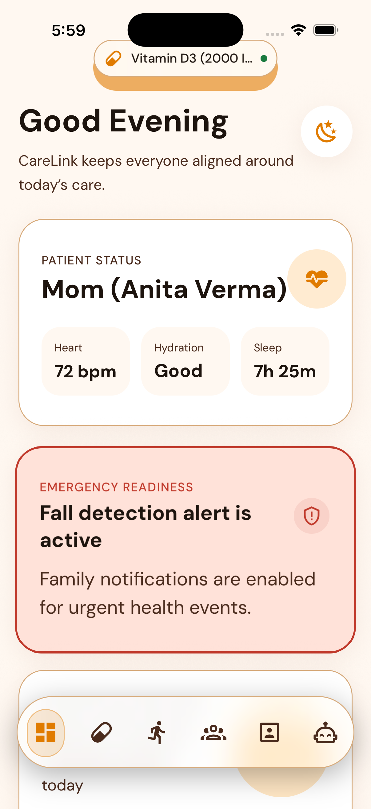
  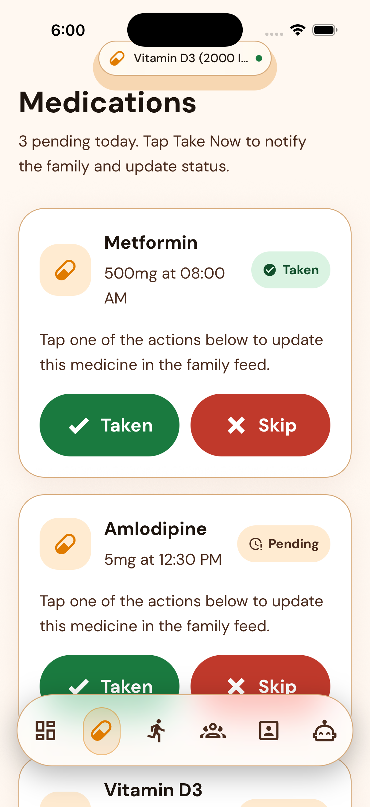
  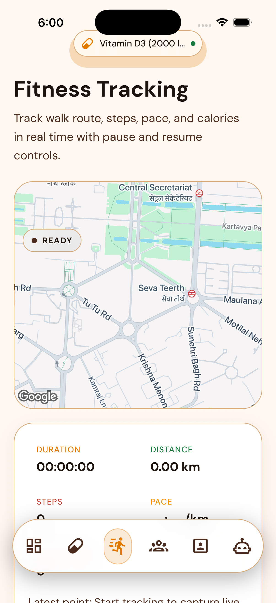
  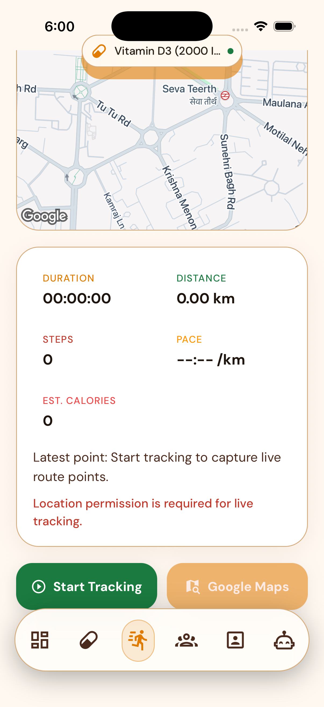
  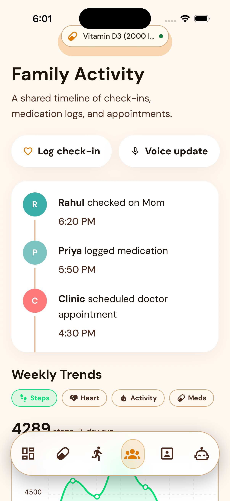
</p>

<p align="center">
  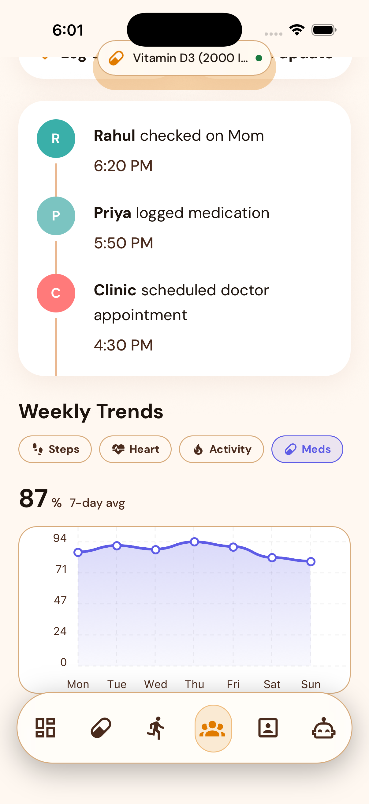
  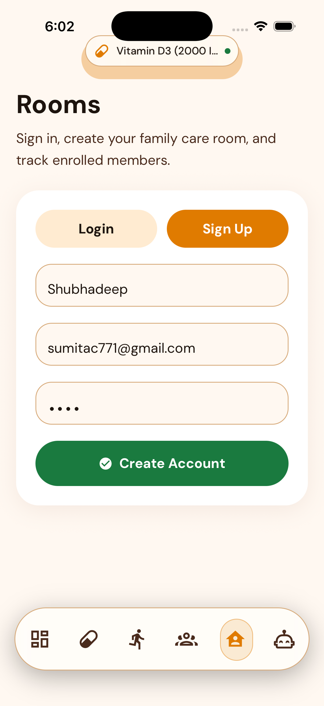
  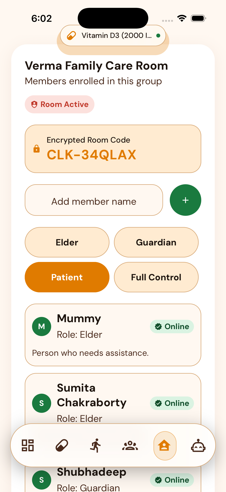
  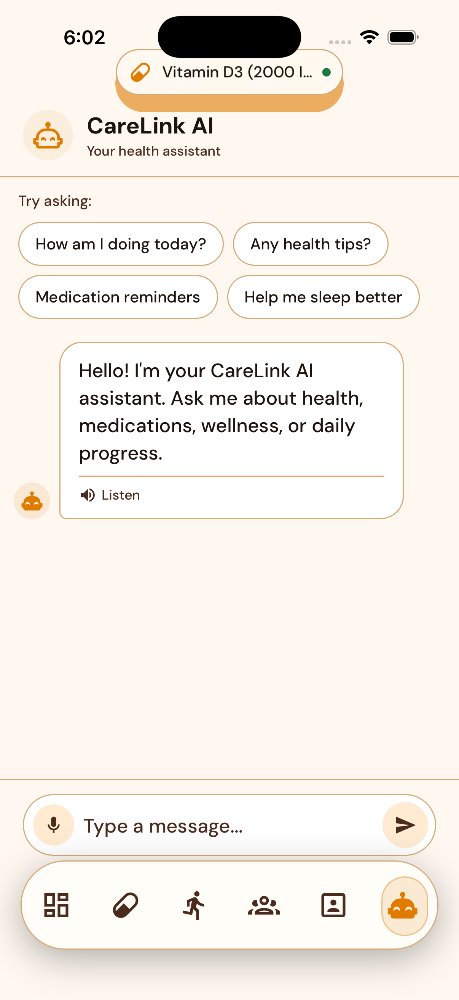
  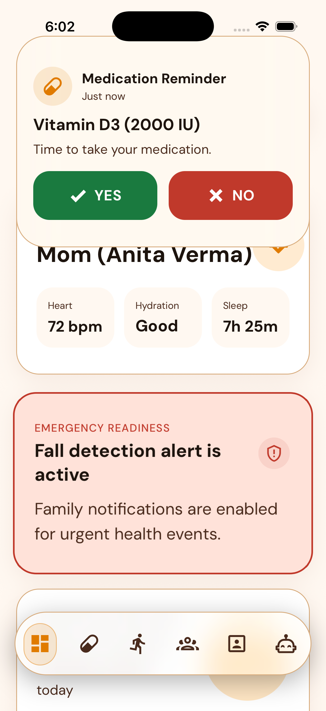
</p>

<p align="center">
  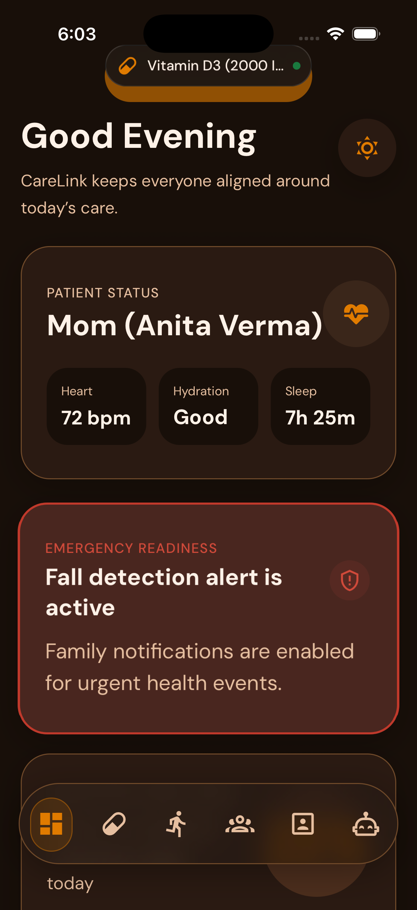
</p>

## Tech Stack

- **Expo** SDK 54
- **React Native** 0.81 / **React** 19
- **TypeScript**
- **React Navigation** (bottom tabs)
- **React Native Reanimated**
- **Expo Haptics**
- **AsyncStorage**

## Features

### Dashboard
- Time-aware greeting with daily care overview
- Patient status card — heart rate, hydration, sleep
- Emergency readiness card with animated pulse
- CareScore showing medication completion progress
- Today's medications preview and upcoming appointments
- Recent family activity feed

### Medications
- Full medication list with pending and taken states
- Tap to mark as taken or skip with family feed notification
- Floating Dynamic Island-style medication reminder

### Fitness Tracking
- Live walk tracking with Google Maps route display
- Duration, distance, steps, pace, and calorie stats
- Start, pause, resume, and stop controls

### Family Activity
- Shared timeline of check-ins, medication logs, and appointments
- Weekly trends graph for steps, heart rate, activity, and meds
- Log check-in and voice update actions

### Rooms
- Create a family care room with a unique room code
- Invite and manage members with role-based access (Elder, Guardian, Patient, Full Control)
- Online/offline presence indicators
- Persistent auth state via AsyncStorage

### CareLink AI
- Built-in health assistant chat
- Quick prompts for daily health questions, medication reminders, and wellness tips
- Text-to-speech listen support

### Theme
- Light and dark mode with smooth animated crossfade transition
- Warm orange/red palette with soft off-white and deep brown tones

## Getting Started

```bash
npm install
npx expo start
```

Scan the QR code with Expo Go on your phone to run the app.

> **Note:** The app currently uses mock data and local-only persistence. There is no live backend or real authentication.

